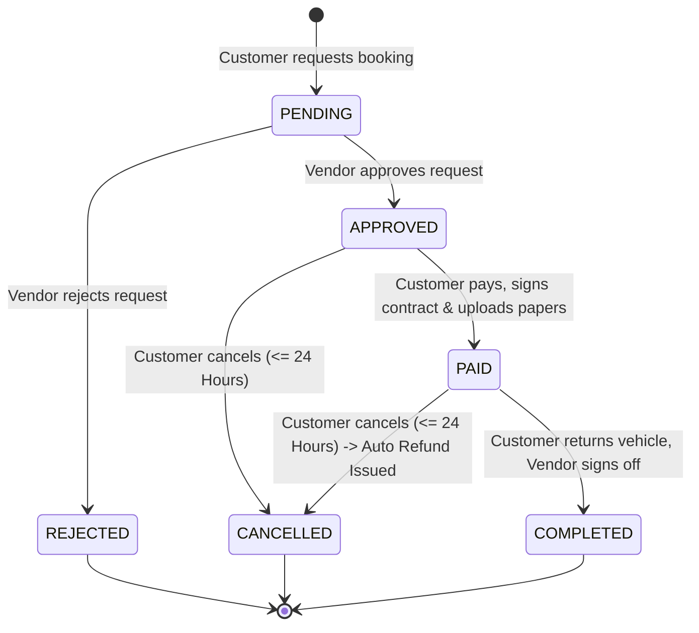
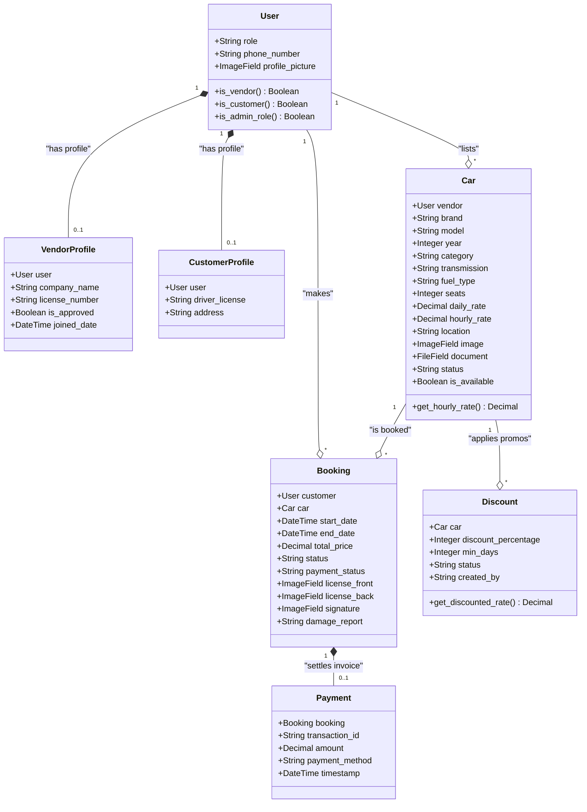
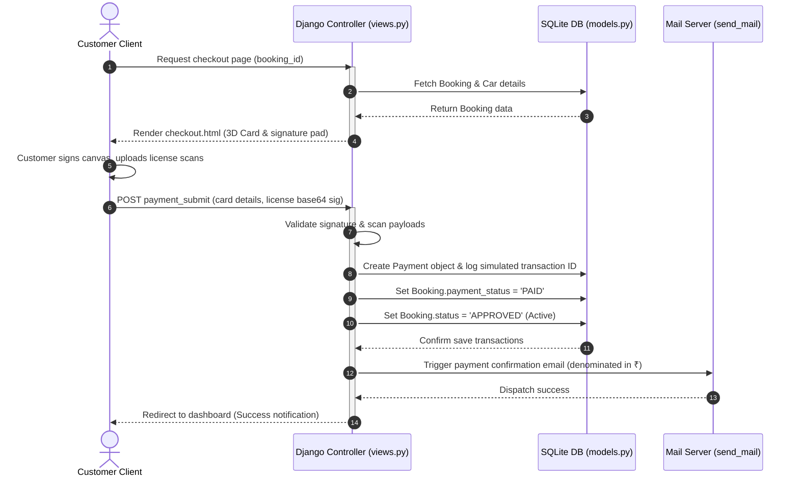

# Web Wizards Car Rentals: Comprehensive Software Engineering Specification & Project Report

---

## Document Metadata
- **Project Title**: Web Wizards Car Rentals
- **System Domain**: On-Demand Multi-Role B2C Car Rental Platform
- **Release Version**: 2.4.0-Rupee-Standard
- **Author**: Lead Systems Architect & Software Engineer
- **Structure Reference**: Note.txt System Specifications

---

## Table of Contents
1. [Problem Statement](#1-problem-statement)
2. [Requirements Gathering](#2-requirements-gathering)
3. [User Analysis](#3-user-analysis)
4. [Documentation & Repository Structure](#4-documentation--repository-structure)
5. [Workflow & Planning](#5-workflow--planning)
6. [UI/UX Design (Frontend)](#6-uiux-design-frontend)
7. [Database Design](#7-database-design)
8. [Architecture](#8-architecture)
9. [Backend (Controller & Business Logic)](#9-backend-controller--business-logic)
10. [Frontend (Client-side & Interactions)](#10-frontend-client-side--interactions)
11. [Integration (API & Internal Routes)](#11-integration-api--internal-routes)
12. [Server & Deployment Infrastructure](#12-server--deployment-infrastructure)
13. [Testing & Quality Assurance Suite](#13-testing--quality-assurance-suite)

---

## 1. Problem Statement

### 1.1 Context and Industry Background
The vehicle rental industry has traditionally operated under fragmented paradigms dominated by localized agency desks, opaque pricing matrices, and physical paper-trailing. With the advent of web technologies, localized players attempted digital transformations, yet modern sharing economy B2C networks still suffer from three fatal friction points:
1. **Inefficient Supplier Onboarding & Credential Auditing**: Small-scale fleet owners (vendors) are either locked out by giant aggregators or allowed onto open marketplaces without systematic document checks (registration papers, commercial insurance validation), exposing customers to legal liabilities.
2. **Pricing Discrepancies and Opaque Fee Calculations**: Traditional calculators lack smart flexibility. Rentals transitioning across daily boundaries are billed raw 24-hour cycles, completely disregarding fair hourly capping. Furthermore, promo codes and conditional discounts are hardcoded or manually added, creating booking-time friction.
3. **Weak Rental Verification and Collateral Protocols**: Unlike standard taxi-hailing, self-drive rentals demand rigorous customer checks. The lack of structured document checkpoints (driver license logs, base64 digital signatures, clear damage logging, and original physical vehicle/RC card deposits) creates high security risks for vehicle owners.

### 1.2 The Proposed Solution: Web Wizards Car Rentals
To address these issues, we designed a unified, self-contained multi-role Django platform standardizing B2C rentals.

```
┌─────────────────────────────────────────────────────────────────────────┐
│                       Web Wizards Car Rentals Platform                  │
├────────────────────────┬────────────────────────┬───────────────────────┤
│    Customers Role      │      Vendors Role      │    Administrators     │
│   • Search & Filter    │   • Fleet Management   │   • Vendor Auditing   │
│   • Interactive Book   │   • Set Rates (₹/hr)   │   • Car Verification  │
│   • Checkout & Sign    │   • Approve / Reject   │   • Dispute Queue     │
│   • Reviews & Rating   │   • Earnings Ledger    │   • Promo Controls    │
└────────────────────────┴────────────────────────┴───────────────────────┘
```

The system delivers:
- **Comprehensive Document Verification**: A multi-step verification pipeline where suppliers upload structural PDF registrations, and customers upload license scans at checkout.
- **Smart Adaptive Pricing Engine**: A logic framework calculating rental fees using native daily rates and partial hourly charges—automatically capped at a single day's rate—with localized currency formatting in Indian Rupees (`₹`).
- **Mutual Discount Negotiation System**: A shared environment allowing admins to request promos from vendors, who can accept and deploy them with a single click.

---

## 2. Requirements Gathering

The requirements gathering process involved outlining target user expectations, system boundaries, compliance matrices, and scaling properties.

### 2.1 Functional Requirements (FR)

#### 2.1.1 Guest/Anonymous User Requirements
- **FR-1.1**: The system must allow guest users to search for approved vehicles by location, category, transmission type, and maximum price.
- **FR-1.2**: The system must allow guest users to register as a Customer or Vendor, accompanied by a double-factor session-based OTP verification.
- **FR-1.3**: The system must allow users to request password resets via OTP email loops.

#### 2.1.2 Registered Customer Requirements
- **FR-2.1**: A Customer must be able to view detailed specifications and photo galleries of approved cars.
- **FR-2.2**: A Customer must be able to check real-time vehicle availability via an interactive calendar, blocking reserved date ranges.
- **FR-2.3**: A Customer must be able to request booking reservations, which are sent to the supplier's approval queue.
- **FR-2.4**: A Customer must be able to complete payment checkout via a simulated credit card gateway, including digital license upload, digital signature capture, and damage condition logs.
- **FR-2.5**: A Customer must be able to download itemized invoice PDFs denominated in Rupees (`₹`).
- **FR-2.6**: A Customer must be able to cancel bookings within 24 hours of creation, triggering automated payment refund logs.
- **FR-2.7**: A Customer must be able to submit post-rental star reviews and submit formal complaints/disputes.

#### 2.1.3 Registered Vendor (Supplier) Requirements
- **FR-3.1**: A Vendor must submit verification documents (Company Name, Official Supplier License) to be approved.
- **FR-3.2**: A Vendor must be able to add, edit, and delete vehicles.
- **FR-3.3**: A Vendor must upload multiple vehicle gallery photos and registration/insurance files.
- **FR-3.4**: A Vendor must be able to accept or reject incoming customer booking requests.
- **FR-3.5**: A Vendor must be able to define custom Daily Rates and optional Hourly Rates.
- **FR-3.6**: A Vendor must be able to launch custom multi-day discount campaigns.
- **FR-3.7**: A Vendor must be able to mark active rentals as returned, instantly releasing vehicle availability.

#### 2.1.4 System Administrator Requirements
- **FR-4.1**: An Admin must be able to approve or reject pending vendor applications.
- **FR-4.2**: An Admin must be able to audit and list/reject new vehicle additions.
- **FR-4.3**: An Admin must be able to resolve open dispute complaints.
- **FR-4.4**: An Admin must be able to suggest promotional discounts to specific vendors.
- **FR-4.5**: An Admin must be able to view consolidated platform revenue reports.

### 2.2 Non-Functional Requirements (NFR)
- **NFR-1 (Security)**: Password storage must be hashed using Django's PBKDF2 algorithm. Session validation must enforce authentication checks for all roles.
- **NFR-2 (Performance)**: Dynamic price updates and calendar availability renderings must execute client-side in under 150ms.
- **NFR-3 (Data Integrity)**: Prevent double-booking conflicts at the database transaction layer.
- **NFR-4 (UI/UX Aesthetic)**: Interface components must utilize CSS Variables supporting responsive HSL color maps, backdrop filters, and glassmorphic card configurations.
- **NFR-5 (Robustness)**: Django forms and API points must handle faulty date formats, negative rates, and invalid digital signature structures gracefully.

---

## 3. User Analysis

The platform serves three user roles with distinct behaviors and goals.

### 3.1 User Personas
1. **Renter (Customer - "Anjali")**: Tech-savvy, seeks cost-effective, fully transparent booking. Needs real-time price calculators, flexible hour boundaries, and instant checkout.
2. **Fleet Supplier (Vendor - "Rajesh")**: Owns 10 cars. Demands simple listing interfaces, secure collateral policies (two-wheeler and license deposit logs), absolute date-conflict checks, and comprehensive billing records.
3. **Ops Manager (Admin - "Vikram")**: Reviews legal compliance, verifies insurance/license documents, resolves customer disputes, and manages marketing campaigns.

### 3.2 UML Use Case Diagram
This diagram outlines the primary interactions of the three user types with the system boundaries.

```mermaid
leftToRightDirection
usecase UC_Register as "Register with OTP"
usecase UC_Browse as "Browse & Filter Cars"
usecase UC_Book as "Request Rental Booking"
usecase UC_Pay as "Simulate Pay, Sign & Upload"
usecase UC_Dispute as "Raise Dispute / Complaint"
usecase UC_ManageFleet as "Manage Vehicle Fleet (List/Edit)"
usecase UC_ApproveBooking as "Accept / Reject Booking"
usecase UC_Return as "Mark Vehicle Returned"
usecase UC_Promo as "Launch Promotion Campaigns"
usecase UC_Audit as "Verify Vendors & Car Specs"
usecase UC_Resolve as "Resolve Disputes"

Customer --> UC_Register
Customer --> UC_Browse
Customer --> UC_Book
Customer --> UC_Pay
Customer --> UC_Dispute

Vendor --> UC_Register
Vendor --> UC_ManageFleet
Vendor --> UC_ApproveBooking
Vendor --> UC_Return
Vendor --> UC_Promo

Admin --> UC_Audit
Admin --> UC_Resolve
Admin --> UC_Promo
```

---

## 4. Documentation & Repository Structure

The system is organized into a modular Django structure, ensuring clear separation of settings, routes, view controllers, database tables, and presentation templates.

### 4.1 Folder and File Inventory

```
Car_rental_system_2/
│
├── web_wizards_rentals/         # Core System Configurations
│   ├── settings.py              # Database settings, apps, auth, and static configuration
│   ├── urls.py                  # Project-level url routing rules
│   ├── wsgi.py / asgi.py        # Server interface entry points
│   └── __init__.py
│
├── car_rental/                  # Core Business Application
│   ├── migrations/              # Database migration history
│   ├── models.py                # Database entity relationship schemas
│   ├── views.py                 # Core Controller logic & request processors
│   ├── urls.py                  # App-level routing mapping
│   ├── admin.py                 # Admin registration specifications
│   ├── tests.py                 # Integrated TDD Unit Test Suites
│   └── apps.py                  # Application metadata
│
├── templates/                   # UI Presentation Tier (HTML + JS)
│   ├── base.html                # Main glassmorphic wrapper layout
│   ├── index.html               # Homepage & featured fleets
│   ├── car_search.html          # Dynamic filtering screen
│   ├── car_detail.html          # specs, reviews, and interactive calendar booker
│   ├── checkout.html            # 3D payment credit card & digital signature pad
│   ├── invoice.html             # Rupee invoice sheet
│   ├── dashboard_customer.html  # Customer panel & history
│   ├── dashboard_vendor.html    # Vendor fleet control, ledger & promo builder
│   ├── dashboard_admin.html     # Admin approvals hub, promotions & disputes
│   ├── edit_car.html            # Supplier specs modifier
│   ├── edit_profile.html        # Profile fields management
│   ├── forgot_password.html     # Password reset email page
│   ├── forgot_password_verify.html # Password reset OTP and new password setter
│   ├── login.html               # Credential validation page
│   ├── register.html            # Double-factor registration form
│   └── verify_otp.html          # Registration OTP verification screen
│
├── static/                      # Custom style sheets and logo assets
├── media/                       # Scanned licenses, signatures, documents, and car files
├── manage.py                    # Django CLI executive script
├── requirements.txt             # Environment dependencies list
└── db.sqlite3                   # Active SQLite relational database
```

---

## 5. Workflow & Planning

Developing Web Wizards Car Rentals required meticulous planning of the state lifecycle of vehicle listings, promotional structures, and rental agreements.

### 5.1 Booking State Machine Diagram
A booking moves through several states depending on vendor approvals, customer actions, and return sequences.



### 5.2 Chronological Operation Lifecycle
1. **Supplier Listing Verification**: Vendor creates an account, uploads business licenses, and registers a vehicle with insurance papers. The listing remains in a `PENDING` state, invisible to customers, until approved by an Admin.
2. **Interactive Date Locking**: When a customer clicks calendar dates, a JavaScript handler checks blocked intervals. The form updates the database total price immediately.
3. **Double Booking Isolation**: Upon POST, Django queries the database using an overlapping interval algorithm (`start_date <= requested_end` and `end_date >= requested_start`).
4. **Approval Loop**: The supplier is notified via their dashboard and can view user profiles, phone numbers, and rental durations before approving or rejecting.
5. **Checkout & Digitization**: The customer proceeds to checkout. They enter credit card details (visualized in a 3D interface), draw their signature on an HTML5 canvas, and upload license scans. A simulated transaction ID is created, and the booking becomes `PAID` (Active).
6. **Return Handover**: After the rental, the vendor reviews the car. If satisfied, they click "Mark Returned". The car is marked as available, and the customer can leave a review.

---

## 6. UI/UX Design (Frontend)

The application features a modern visual design that avoids generic, default browser layouts.

### 6.1 Design Token System (CSS Root Variables)
The visual framework is controlled by a unified, responsive variables map in `base.html`:

```css
:root {
    --bg-main: #0B0F19;           /* Premium deep dark background */
    --bg-card: rgba(17, 24, 39, 0.6); /* Translucent glass card background */
    --border-color: rgba(255, 255, 255, 0.08);
    --border-color-hover: rgba(255, 255, 255, 0.18);
    
    /* Harmonious HSL Accent Colors */
    --primary: #4F46E5;           /* Indigo base tone */
    --primary-glow: rgba(79, 70, 229, 0.3);
    --accent: #EC4899;            /* Hot Pink accent */
    --accent-glow: rgba(236, 72, 153, 0.3);
    
    /* Feedback status variables */
    --success: #10B981;           /* Emerald Green */
    --warning: #F59E0B;           /* Vibrant Amber */
    --danger: #EF4444;            /* Coral Red */
    
    /* Typography variables */
    --text-main: #F3F4F6;         /* Bright gray readability text */
    --text-muted: #9CA3AF;        /* Slate gray secondary text */
    --glass-shadow: 0 8px 32px 0 rgba(0, 0, 0, 0.37);
    --transition: all 0.3s cubic-bezier(0.4, 0, 0.2, 1);
}
```

### 6.2 Key Screen Designs and Layouts
- **Home (`index.html`)**: Features a futuristic landing hero section with glowing borders and a search card. A list of featured premium fleets displays their daily rates in Rupees (`₹`) with a neon scale-up effect on hover.
- **Search Console (`car_search.html`)**: A dual-column layout. The left column contains the search filters, and the right displays matching vehicle cards.
- **Spec Details Page (`car_detail.html`)**: Focuses on specs. Features a responsive photo gallery slider and a floating calendar booking card on the right.
- **Checkout Simulator (`checkout.html`)**: Features a simulated card interface that flips dynamically when the CVV input is selected. It includes a signature box with HTML5 canvas and clear instructions about mandatory RC collateral policies.

---

## 7. Database Design

The data persistence layer is handled by Django’s Object Relational Mapper (ORM), mapping Python class variables directly to SQLite database constraints.

### 7.1 Database Fields and Model Structure

#### User Model
- **`role`**: `CharField` (Choices: `CUSTOMER`, `VENDOR`, `ADMIN`).
- **`phone_number`**: `CharField` (Max: 15, optional).
- **`profile_picture`**: `ImageField` (uploaded to `profiles/`, optional).

#### VendorProfile Model
- **`user`**: `OneToOneField` mapping to User (Cascading deletion).
- **`company_name`**: `CharField` (Max: 100, optional).
- **`license_number`**: `CharField` (Max: 50, mandatory for validation).
- **`is_approved`**: `BooleanField` (Defaults to `False`, approved by Admin).

#### CustomerProfile Model
- **`user`**: `OneToOneField` mapping to User.
- **`driver_license`**: `CharField` (Max: 50, mandatory).
- **`address`**: `TextField` (optional).

#### Car Model
- **`vendor`**: `ForeignKey` mapping to User.
- **`brand` / `model`**: `CharField` (Max: 50).
- **`year`**: `PositiveIntegerField` (Year constraint).
- **`category`**: `CharField` (Choices: `SEDAN`, `SUV`, `LUXURY`, `ELECTRIC`, `SPORTS`).
- **`transmission`**: `CharField` (Choices: `AUTO`, `MANUAL`).
- **`fuel_type`**: `CharField` (Choices: `PETROL`, `DIESEL`, `ELECTRIC`, `HYBRID`).
- **`seats`**: `PositiveIntegerField` (Defaults to 5).
- **`daily_rate`**: `DecimalField` (Max digits: 8, places: 2, positive).
- **`hourly_rate`**: `DecimalField` (Max digits: 8, places: 2, defaults to 0.00).
- **`location`**: `CharField` (Max: 100).
- **`image`**: `ImageField` (cover photo).
- **`document`**: `FileField` (registration/insurance validation PDF).
- **`status`**: `CharField` (Choices: `PENDING`, `APPROVED`, `REJECTED`).
- **`is_available`**: `BooleanField` (Defaults to `True`).

#### Booking Model
- **`customer`**: `ForeignKey` mapping to Customer User.
- **`car`**: `ForeignKey` mapping to booked Car listing.
- **`start_date` / `end_date`**: `DateTimeField` (Exact rental boundaries).
- **`total_price`**: `DecimalField` (Max digits: 10, places: 2).
- **`status`**: `CharField` (Choices: `PENDING`, `APPROVED`, `REJECTED`, `COMPLETED`, `CANCELLED`).
- **`payment_status`**: `CharField` (Choices: `PENDING`, `PAID`, `REFUNDED`).
- **`license_front` / `license_back`**: `ImageField` (Upload scans during checkout).
- **`signature`**: `ImageField` (captures digital signature input).
- **`damage_report`**: `TextField` (JSON log of structural highlights).

#### Payment Model
- **`booking`**: `OneToOneField` mapping to associated Booking.
- **`transaction_id`**: `CharField` (Unique, unique database constraint).
- **`amount`**: `DecimalField` (Max digits: 10, places: 2).
- **`payment_method`**: `CharField` (Defaults to `'Credit Card'`).
- **`timestamp`**: `DateTimeField` (Defaults to current server timestamp).

#### Discount Model
- **`car`**: `ForeignKey` mapping to target vehicle.
- **`discount_percentage`**: `PositiveIntegerField` (1 to 100 constraint).
- **`min_days`**: `PositiveIntegerField` (Threshold for discount, defaults to 1).
- **`status`**: `CharField` (Choices: `PENDING_VENDOR`, `APPROVED`, `REJECTED`).
- **`created_by`**: `CharField` (Choices: `ADMIN`, `VENDOR`).

### 7.2 UML Database Class Diagram
This class diagram illustrates the ORM entities, attributes, methods, and relationships.



---

## 8. Architecture

The system utilizes Django's multi-tier structure to handle business logic, database queries, and client-side interactions.

### 8.1 Model-View-Template Interaction Sequence
The following sequence diagram illustrates the process of a customer checking out, drawing their signature, submitting payment, and the backend verifying rates in Rupees (`₹`) and updating the database state.



---

## 9. Backend (Controller & Business Logic)

The controller layer (`views.py`) serves as the core logic engine, handling authentication, OTP flows, discount structures, and price calculations.

### 9.1 Adaptive Price Calculation Engine
The system uses a custom calculation method in `book_car` and `car_detail` JavaScript:
1. **Total Hours**: Calculates the absolute difference between pickup and return timestamps in hours.
2. **Days and Extra Hours**: Divides total hours by 24 to isolate full days and remaining hours.
3. **Hourly Cap**: Computes the extra hour cost by multiplying remaining hours by the hourly rate. This extra charge is capped at a full day's daily rate.
4. **Base Total**: Combines the daily rate sum and the capped extra hour charges.
5. **Database Promo Application**: Queries all approved `Discount` entries for the car, identifies the highest percentage threshold matching the rental duration, and deducts the discount amount.

```python
# Backend representation of the pricing engine in views.py
duration = end_date - start_date
total_hours = duration.total_seconds() / 3600

import math
days = int(total_hours // 24)
remaining_hours = int(math.ceil(total_hours % 24))

# Retrieve custom hourly rate or fall back to daily_rate / 24
hourly_rate = car.hourly_rate if car.hourly_rate > 0 else Decimal(round(float(car.daily_rate) / 24, 2))

# Cap extra hours charge at a full daily rate
extra_charge = min(Decimal(remaining_hours) * hourly_rate, car.daily_rate)
total_price = (Decimal(days) * car.daily_rate) + extra_charge

# Apply tiered discounts
total_days = total_hours / 24
discount_rate = Decimal('0.0')

# Query active promotions sorted by min_days threshold
active_promos = Discount.objects.filter(car=car, status='APPROVED').order_by('-min_days')
for promo in active_promos:
    if total_days >= promo.min_days:
        discount_rate = Decimal(promo.discount_percentage) / Decimal('100.0')
        break
        
discount_amount = total_price * discount_rate
total_price = round(total_price - discount_amount, 2)
```

### 9.2 Registration and Password Reset OTP Verification
Authentication utilizes a secure session-backed OTP generator to verify customer and vendor roles:
1. **Generation**: The system creates a random 6-digit number, stores it in the Django session (`request.session['registration_otp']`), and saves the registration fields in a temporary dictionary (`request.session['pending_registration']`).
2. **OTP Dispatch**: Sends the OTP using Django's email dispatcher.
3. **Verification**: When submitted, the system compares the entered OTP with the session value. If matched, it commits the user registration to the database and clears the temporary session memory.

---

## 10. Frontend (Client-side & Interactions)

Rich client-side interactions are implemented using Vanilla JavaScript, enhancing the user experience.

### 10.1 Key Frontend Features

#### A. Interactive Calendar Picker
- Dynamically generates calendar grids for custom months.
- Cross-references a JSON list of blocked dates (`blocked_ranges_json`) passed from Django to disable reserved date cells.
- Handles date ranges by setting start and end boundaries on click, automatically updating hidden form inputs and trigger calculations.

#### B. 3D Credit Card Flipper
- Automatically syncs input text (Cardholder Name, Expiry, Card Number) with card design elements.
- Listens to CVV focus events, triggering a CSS 3D transformation `transform: rotateY(180deg)` to show the back of the card.

#### C. HTML5 Digital Signature Pad
- Initializes a standard canvas listener tracking touch/mouse paths.
- Compresses line configurations into base64 data URLs on form submit, sending them to the backend to be saved as PNG signature assets.

```javascript
// Front-end signature pad capture implementation
const canvas = document.getElementById('signature-pad');
if (canvas) {
    const ctx = canvas.getContext('2d');
    let drawing = false;

    canvas.addEventListener('mousedown', () => drawing = true);
    canvas.addEventListener('mouseup', () => {
        drawing = false;
        ctx.beginPath();
        // Convert to base64 input field
        document.getElementById('signature_base64').value = canvas.toDataURL();
    });
    canvas.addEventListener('mousemove', draw);

    function draw(event) {
        if (!drawing) return;
        ctx.lineWidth = 2;
        ctx.lineCap = 'round';
        ctx.strokeStyle = '#4F46E5'; // Match Indigo Design System
        ctx.lineTo(event.clientX - canvas.getBoundingClientRect().left, event.clientY - canvas.getBoundingClientRect().top);
        ctx.stroke();
        ctx.beginPath();
        ctx.moveTo(event.clientX - canvas.getBoundingClientRect().left, event.clientY - canvas.getBoundingClientRect().top);
    }
}
```

---

## 11. Integration (API & Internal Routes)

The platform utilizes a structured internal REST framework to connect client-side components with the backend.

### 11.1 Key API Endpoints
- **`/discount/admin/add/` (POST)**: Admin sends marketing discount requests to a supplier.
- **`/discount/<id>/respond/<action>/` (POST)**: Vendor accepts (`ACCEPT`) or rejects (`REJECT`) admin-suggested discount campaigns.
- **`/car/<id>/review/` (POST)**: Submits customer ratings and comment records to update the car’s review history.
- **`/register/verify/` (POST)**: Validates registration OTP tokens.

### 11.2 Transaction Security & Verification
To guarantee transaction safety, all state-changing endpoints enforce CSRF protections using Django's template tag ``. Direct model mutations check owner relationships to prevent security bypasses:

```python
# Secure context validation inside view controllers
booking = get_object_or_404(Booking, id=booking_id)
if booking.car.vendor != request.user:
    messages.error(request, "Unauthorized access bypass attempted.")
    return redirect('dashboard')
```

---

## 12. Server & Deployment Infrastructure

The system is configured for reliable local hosting and production scaling.

### 12.1 Deployment Pipeline Components

```
┌─────────────────┐       ┌─────────────────┐       ┌─────────────────┐
│   Gunicorn WSGI │ ◄───► │  Django core    │ ◄───► │  SQLite Database│
│  (HTTP Server)  │       │   Framework     │       │   (db.sqlite3)  │
└────────┬────────┘       └─────────────────┘       └─────────────────┘
         │
         ▼
┌─────────────────┐
│ Static & Media  │
│ Asset Directories│
└─────────────────┘
```

- **WSGI/ASGI Entry Points**: Configured in `web_wizards_rentals/wsgi.py` and `web_wizards_rentals/asgi.py` to route HTTP requests through the production Gunicorn web server.
- **Procfile**: Defines the production runtime command to launch the Gunicorn application thread:
  ```
  web: gunicorn web_wizards_rentals.wsgi
  ```
- **Pip Dependencies (`requirements.txt`)**: Locks all critical libraries (Django, Gunicorn, Pillow for image processing) to prevent environment conflicts.

---

## 13. Testing & Quality Assurance Suite

We followed strict Test-Driven Development (TDD) methodologies, implementing extensive integration test suites in `car_rental/tests.py`.

### 13.1 Coverage of the Test Suite
- **`test_user_roles`**: Asserts correct behavior for helper functions (`is_customer()`, `is_vendor()`, `is_admin_role()`).
- **`test_double_booking_prevention`**: Verifies that booking overlapping dates on a reserved vehicle throws an error and rejects the request.
- **`test_booking_cancellation_within_24_hours`**: Verifies that cancellations within the 24-hour window refund customer balances successfully.
- **`test_booking_cancellation_after_24_hours`**: Ensures cancellations requested past 24 hours are blocked.
- **`test_time_based_pricing_calculation`**: Runs three test cases in Indian Rupees (`₹`):
  1. Renting for 5 hours at a base rate of ₹10/hr returns exactly ₹50.
  2. Renting for 12 hours caps the charge at a full day’s ₹100 rate.
  3. Renting for 27 hours returns a sum of a full day plus capped extra hours (₹130 total).

---
*End of Software Specification Document.*
