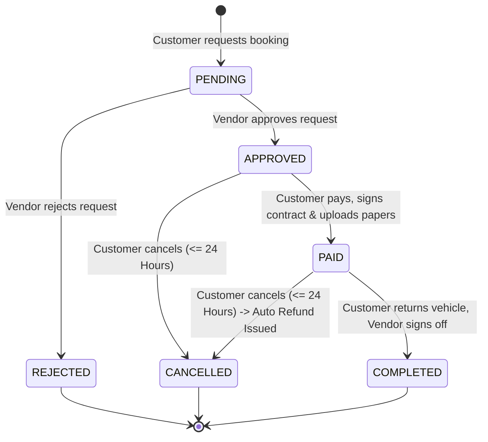
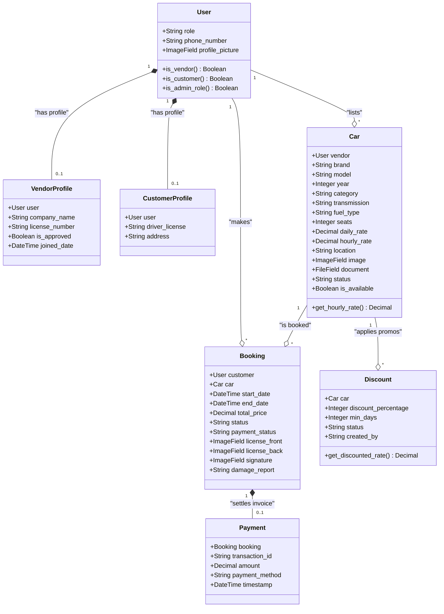
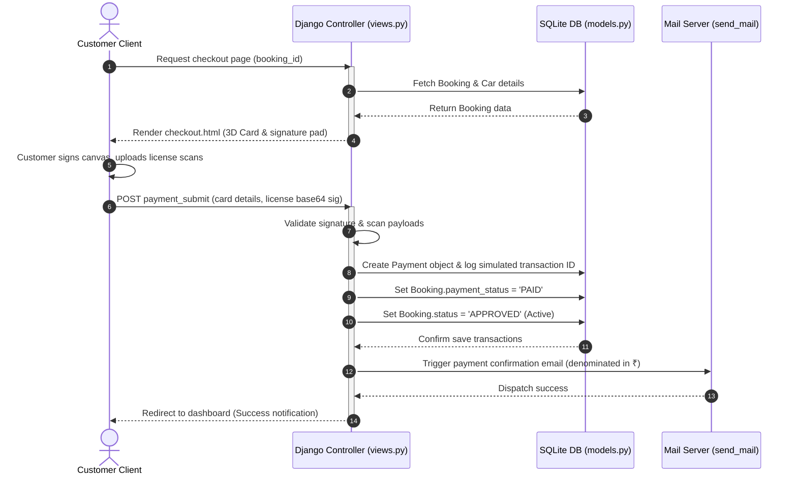

# Web Wizards Car Rentals: Comprehensive Software Engineering Specification & Project Report

---

## Document Metadata
- **Project Title**: Web Wizards Car Rentals
- **System Domain**: On-Demand Multi-Role B2C Car Rental Platform
- **Release Version**: 2.4.0-Rupee-Standard
- **Author**: Lead Systems Architect & Software Engineer
- **Structure Reference**: Note.txt System Specifications

---

## Table of Contents
1. [Problem Statement](#1-problem-statement)
2. [Requirements Gathering](#2-requirements-gathering)
3. [User Analysis](#3-user-analysis)
4. [Documentation & Repository Structure](#4-documentation--repository-structure)
5. [Workflow & Planning](#5-workflow--planning)
6. [UI/UX Design (Frontend)](#6-uiux-design-frontend)
7. [Database Design](#7-database-design)
8. [Architecture](#8-architecture)
9. [Backend (Controller & Business Logic)](#9-backend-controller--business-logic)
10. [Frontend (Client-side & Interactions)](#10-frontend-client-side--interactions)
11. [Integration (API & Internal Routes)](#11-integration-api--internal-routes)
12. [Server & Deployment Infrastructure](#12-server--deployment-infrastructure)
13. [Testing & Quality Assurance Suite](#13-testing--quality-assurance-suite)

---

## 1. Problem Statement

### 1.1 Context and Industry Background
The vehicle rental industry has traditionally operated under fragmented paradigms dominated by localized agency desks, opaque pricing matrices, and physical paper-trailing. With the advent of web technologies, localized players attempted digital transformations, yet modern sharing economy B2C networks still suffer from three fatal friction points:
1. **Inefficient Supplier Onboarding & Credential Auditing**: Small-scale fleet owners (vendors) are either locked out by giant aggregators or allowed onto open marketplaces without systematic document checks (registration papers, commercial insurance validation), exposing customers to legal liabilities.
2. **Pricing Discrepancies and Opaque Fee Calculations**: Traditional calculators lack smart flexibility. Rentals transitioning across daily boundaries are billed raw 24-hour cycles, completely disregarding fair hourly capping. Furthermore, promo codes and conditional discounts are hardcoded or manually added, creating booking-time friction.
3. **Weak Rental Verification and Collateral Protocols**: Unlike standard taxi-hailing, self-drive rentals demand rigorous customer checks. The lack of structured document checkpoints (driver license logs, base64 digital signatures, clear damage logging, and original physical vehicle/RC card deposits) creates high security risks for vehicle owners.

### 1.2 The Proposed Solution: Web Wizards Car Rentals
To address these issues, we designed a unified, self-contained multi-role Django platform standardizing B2C rentals.

```
┌─────────────────────────────────────────────────────────────────────────┐
│                       Web Wizards Car Rentals Platform                  │
├────────────────────────┬────────────────────────┬───────────────────────┤
│    Customers Role      │      Vendors Role      │    Administrators     │
│   • Search & Filter    │   • Fleet Management   │   • Vendor Auditing   │
│   • Interactive Book   │   • Set Rates (₹/hr)   │   • Car Verification  │
│   • Checkout & Sign    │   • Approve / Reject   │   • Dispute Queue     │
│   • Reviews & Rating   │   • Earnings Ledger    │   • Promo Controls    │
└────────────────────────┴────────────────────────┴───────────────────────┘
```

The system delivers:
- **Comprehensive Document Verification**: A multi-step verification pipeline where suppliers upload structural PDF registrations, and customers upload license scans at checkout.
- **Smart Adaptive Pricing Engine**: A logic framework calculating rental fees using native daily rates and partial hourly charges—automatically capped at a single day's rate—with localized currency formatting in Indian Rupees (`₹`).
- **Mutual Discount Negotiation System**: A shared environment allowing admins to request promos from vendors, who can accept and deploy them with a single click.

---

## 2. Requirements Gathering

The requirements gathering process involved outlining target user expectations, system boundaries, compliance matrices, and scaling properties.

### 2.1 Functional Requirements (FR)

#### 2.1.1 Guest/Anonymous User Requirements
- **FR-1.1**: The system must allow guest users to search for approved vehicles by location, category, transmission type, and maximum price.
- **FR-1.2**: The system must allow guest users to register as a Customer or Vendor, accompanied by a double-factor session-based OTP verification.
- **FR-1.3**: The system must allow users to request password resets via OTP email loops.

#### 2.1.2 Registered Customer Requirements
- **FR-2.1**: A Customer must be able to view detailed specifications and photo galleries of approved cars.
- **FR-2.2**: A Customer must be able to check real-time vehicle availability via an interactive calendar, blocking reserved date ranges.
- **FR-2.3**: A Customer must be able to request booking reservations, which are sent to the supplier's approval queue.
- **FR-2.4**: A Customer must be able to complete payment checkout via a simulated credit card gateway, including digital license upload, digital signature capture, and damage condition logs.
- **FR-2.5**: A Customer must be able to download itemized invoice PDFs denominated in Rupees (`₹`).
- **FR-2.6**: A Customer must be able to cancel bookings within 24 hours of creation, triggering automated payment refund logs.
- **FR-2.7**: A Customer must be able to submit post-rental star reviews and submit formal complaints/disputes.

#### 2.1.3 Registered Vendor (Supplier) Requirements
- **FR-3.1**: A Vendor must submit verification documents (Company Name, Official Supplier License) to be approved.
- **FR-3.2**: A Vendor must be able to add, edit, and delete vehicles.
- **FR-3.3**: A Vendor must upload multiple vehicle gallery photos and registration/insurance files.
- **FR-3.4**: A Vendor must be able to accept or reject incoming customer booking requests.
- **FR-3.5**: A Vendor must be able to define custom Daily Rates and optional Hourly Rates.
- **FR-3.6**: A Vendor must be able to launch custom multi-day discount campaigns.
- **FR-3.7**: A Vendor must be able to mark active rentals as returned, instantly releasing vehicle availability.

#### 2.1.4 System Administrator Requirements
- **FR-4.1**: An Admin must be able to approve or reject pending vendor applications.
- **FR-4.2**: An Admin must be able to audit and list/reject new vehicle additions.
- **FR-4.3**: An Admin must be able to resolve open dispute complaints.
- **FR-4.4**: An Admin must be able to suggest promotional discounts to specific vendors.
- **FR-4.5**: An Admin must be able to view consolidated platform revenue reports.

### 2.2 Non-Functional Requirements (NFR)
- **NFR-1 (Security)**: Password storage must be hashed using Django's PBKDF2 algorithm. Session validation must enforce authentication checks for all roles.
- **NFR-2 (Performance)**: Dynamic price updates and calendar availability renderings must execute client-side in under 150ms.
- **NFR-3 (Data Integrity)**: Prevent double-booking conflicts at the database transaction layer.
- **NFR-4 (UI/UX Aesthetic)**: Interface components must utilize CSS Variables supporting responsive HSL color maps, backdrop filters, and glassmorphic card configurations.
- **NFR-5 (Robustness)**: Django forms and API points must handle faulty date formats, negative rates, and invalid digital signature structures gracefully.

---

## 3. User Analysis

The platform serves three user roles with distinct behaviors and goals.

### 3.1 User Personas
1. **Renter (Customer - "Anjali")**: Tech-savvy, seeks cost-effective, fully transparent booking. Needs real-time price calculators, flexible hour boundaries, and instant checkout.
2. **Fleet Supplier (Vendor - "Rajesh")**: Owns 10 cars. Demands simple listing interfaces, secure collateral policies (two-wheeler and license deposit logs), absolute date-conflict checks, and comprehensive billing records.
3. **Ops Manager (Admin - "Vikram")**: Reviews legal compliance, verifies insurance/license documents, resolves customer disputes, and manages marketing campaigns.

### 3.2 UML Use Case Diagram
This diagram outlines the primary interactions of the three user types with the system boundaries.

```mermaid
leftToRightDirection
usecase UC_Register as "Register with OTP"
usecase UC_Browse as "Browse & Filter Cars"
usecase UC_Book as "Request Rental Booking"
usecase UC_Pay as "Simulate Pay, Sign & Upload"
usecase UC_Dispute as "Raise Dispute / Complaint"
usecase UC_ManageFleet as "Manage Vehicle Fleet (List/Edit)"
usecase UC_ApproveBooking as "Accept / Reject Booking"
usecase UC_Return as "Mark Vehicle Returned"
usecase UC_Promo as "Launch Promotion Campaigns"
usecase UC_Audit as "Verify Vendors & Car Specs"
usecase UC_Resolve as "Resolve Disputes"

Customer --> UC_Register
Customer --> UC_Browse
Customer --> UC_Book
Customer --> UC_Pay
Customer --> UC_Dispute

Vendor --> UC_Register
Vendor --> UC_ManageFleet
Vendor --> UC_ApproveBooking
Vendor --> UC_Return
Vendor --> UC_Promo

Admin --> UC_Audit
Admin --> UC_Resolve
Admin --> UC_Promo
```

### 3.3 Role-Based Interactive Dashboard Specifications
To deliver optimized user experiences, the platform consolidates all interactive controls, metrics, and operations into three distinct role-specific dashboard panels.

```
                  ┌──────────────────────────────────────────────┐
                  │          Role-Specific Login Router          │
                  └──────────────────────┬───────────────────────┘
                                         │ Evaluates User.role
                                         ▼
         ┌───────────────────────────────┼───────────────────────────────┐
         ▼                               ▼                               ▼
┌──────────────────┐            ┌──────────────────┐            ┌──────────────────┐
│  Customer Portal │            │  Vendor Console  │            │  Admin Hub       │
│ - Booking List   │            │ - Fleet Listings │            │ - Vetting Queue  │
│ - Spent Metrics  │            │ - Gross Ledger   │            │ - Profits Metrics│
│ - Dispute Drawer │            │ - Promo Acceptor │            │ - Disputes Desk  │
│ - Active Promos  │            │ - Order Approvals│            │ - Promo Builder  │
└──────────────────┘            └──────────────────┘            └──────────────────┘
```

#### 3.3.1 Customer Portal (dashboard_customer.html)
The Customer Panel aggregates personal metrics and interactive options in a centralized glassmorphic workspace:
1. **Dynamic Rental History Timeline**: Renders stateful listings of all current and historical bookings, showing color-coded HSL badges for each state (`PENDING`, `APPROVED`, `PAID`, `COMPLETED`, `CANCELLED`).
2. **Personal Financial Expenditure Ledger**: Displays the total sum spent on rentals by query-aggregating paid bookings in Rupee format (`₹`).
3. **Temporal Cancellation Controls**: Evaluates a 24-hour booking creation window on client grids, displaying a clickable cancel control only when eligible.
4. **Platform-Wide Promotions Drawer**: Renders a glowing listing of all approved active platform discounts. A client-side loader cross-references overlaps to display real-time availability and lists specific upcoming blocked date ranges.
5. **Dispute Resolution Tracking**: Displays submitted complaint tickets along with their resolution history.

#### 3.3.2 Vendor Control Console (dashboard_vendor.html)
The Vendor Panel provides suppliers with fleet management tools and financial metrics:
1. **Fleet Manager**: Displays all registered vehicles with details on verification states (`PENDING`, `APPROVED`, `REJECTED`). Includes an interactive toggle switch to update vehicle availability instantly.
2. **Supplier Gross Earnings Ledger**: Computes and displays gross vendor earnings by aggregating all bookings linked to the supplier's vehicles that have a status of `PAID`.
3. **Rental Request Approvals Queue**: Displays incoming renter booking requests, giving vendors options to accept (booking becomes `APPROVED`, sending confirmation emails) or reject requests.
4. **Vehicle Return Handover Control**: Allows vendors to mark active rentals as `COMPLETED` upon return, releasing the vehicle's calendar slot instantly for new bookings.
5. **Promo Offer Drawer & Negotiation Desk**: Presents suggested administrative campaigns (`PENDING_VENDOR`). Vendors can accept (status shifts to `APPROVED`) or reject suggested promotions. Vendors can also build custom auto-approved campaigns directly.

#### 3.3.3 Operations Administrative Hub (dashboard_admin.html)
The Admin Panel serves as the operations and compliance center of the platform:
1. **Vendor Application Vetting Queue**: Displays pending vendor credentials, allowing administrators to approve company status or delete invalid profiles.
2. **Fleet Vetting Console**: Displays pending vehicles alongside uploaded commercial insurance PDFs. Administrators can approve the vehicle for public listing or reject it.
3. **Disputes and Claims Queue**: Lists customer complaint tickets with a one-click resolve control to update ticket statuses.
4. **Platform Gross Profit Tracking**: Aggregates all paid bookings across all suppliers, displaying cumulative platform gross revenues.
5. **Marketing Campaign Builder**: Pushes targeted promotional suggestions directly to specific vendor vehicle dashboards.

---

## 4. Documentation & Repository Structure

The system is organized into a modular Django structure, ensuring clear separation of settings, routes, view controllers, database tables, and presentation templates.

### 4.1 Folder and File Inventory

```
Car_rental_system_2/
│
├── web_wizards_rentals/         # Core System Configurations
│   ├── settings.py              # Database settings, apps, auth, and static configuration
│   ├── urls.py                  # Project-level url routing rules
│   ├── wsgi.py / asgi.py        # Server interface entry points
│   └── __init__.py
│
├── car_rental/                  # Core Business Application
│   ├── migrations/              # Database migration history
│   ├── models.py                # Database entity relationship schemas
│   ├── views.py                 # Core Controller logic & request processors
│   ├── urls.py                  # App-level routing mapping
│   ├── admin.py                 # Admin registration specifications
│   ├── tests.py                 # Integrated TDD Unit Test Suites
│   └── apps.py                  # Application metadata
│
├── templates/                   # UI Presentation Tier (HTML + JS)
│   ├── base.html                # Main glassmorphic wrapper layout
│   ├── index.html               # Homepage & featured fleets
│   ├── car_search.html          # Dynamic filtering screen
│   ├── car_detail.html          # specs, reviews, and interactive calendar booker
│   ├── checkout.html            # 3D payment credit card & digital signature pad
│   ├── invoice.html             # Rupee invoice sheet
│   ├── dashboard_customer.html  # Customer panel & history
│   ├── dashboard_vendor.html    # Vendor fleet control, ledger & promo builder
│   ├── dashboard_admin.html     # Admin approvals hub, promotions & disputes
│   ├── edit_car.html            # Supplier specs modifier
│   ├── edit_profile.html        # Profile fields management
│   ├── forgot_password.html     # Password reset email page
│   ├── forgot_password_verify.html # Password reset OTP and new password setter
│   ├── login.html               # Credential validation page
│   ├── register.html            # Double-factor registration form
│   └── verify_otp.html          # Registration OTP verification screen
│
├── static/                      # Custom style sheets and logo assets
├── media/                       # Scanned licenses, signatures, documents, and car files
├── manage.py                    # Django CLI executive script
├── requirements.txt             # Environment dependencies list
└── db.sqlite3                   # Active SQLite relational database
```

---

## 5. Workflow & Planning

Developing Web Wizards Car Rentals required meticulous planning of the state lifecycle of vehicle listings, promotional structures, and rental agreements.

### 5.1 Booking State Machine Diagram
A booking moves through several states depending on vendor approvals, customer actions, and return sequences.



### 5.2 Chronological Operation Lifecycle
1. **Supplier Listing Verification**: Vendor creates an account, uploads business licenses, and registers a vehicle with insurance papers. The listing remains in a `PENDING` state, invisible to customers, until approved by an Admin.
2. **Interactive Date Locking**: When a customer clicks calendar dates, a JavaScript handler checks blocked intervals. The form updates the database total price immediately.
3. **Double Booking Isolation**: Upon POST, Django queries the database using an overlapping interval algorithm (`start_date <= requested_end` and `end_date >= requested_start`).
4. **Approval Loop**: The supplier is notified via their dashboard and can view user profiles, phone numbers, and rental durations before approving or rejecting.
5. **Checkout & Digitization**: The customer proceeds to checkout. They enter credit card details (visualized in a 3D interface), draw their signature on an HTML5 canvas, and upload license scans. A simulated transaction ID is created, and the booking becomes `PAID` (Active).
6. **Return Handover**: After the rental, the vendor reviews the car. If satisfied, they click "Mark Returned". The car is marked as available, and the customer can leave a review.

---

## 6. UI/UX Design & Frontend Implementation Specification

The frontend architecture of **Web Wizards Car Rentals** is built from the ground up on modern design principles that emphasize immersion, high-performance interactions, and responsive visual feedback. By rejecting default browser components, the interface implements a bespoke **Cyber-Noir / Midnight Glassmorphism** aesthetic tailored to high-end digital consumers.

### 6.1 Core Design Philosophy and Usability Guidelines
1. **Premium Cybernetic Depth**: Employs a dark midnight backdrop integrated with floating glowing neon accents and a responsive matrix cyber-grid to convey speed, technology, and luxury.
2. **Glassmorphism Layering Hierarchy**: Utilizes translucent panels with backdrop-blur filters, thin luminous borders, and soft shadows to simulate layers of physically-stacked glass cards.
3. **Cognitive Load Minimization & Micro-Interactions**: Provides immediate visual rewards for user actions. Hover actions trigger 3D perspective shifts, glow enhancements, and smooth hardware-accelerated transitions.
4. **Mobile-First Responsiveness**: Core grid layouts dynamically collapse from complex multi-column viewports into simple, clean vertical stacks, replacing traditional sidebars with off-canvas drawer systems.

### 6.2 The Design Token System (CSS Root Variables)
The system establishes a single source of truth for the entire interface using responsive CSS custom properties defined within the root block of `base.html`:

| CSS Custom Property | Exact Color Code / Value | Functional UI/UX Role |
| :--- | :--- | :--- |
| `--bg-main` | `#0B0F19` (Deep Midnight Black) | Base canvas background for the entire application |
| `--bg-darker` | `#07090F` (Pitch Obsidian) | Dark contrast background for off-canvas drawer navigation and footers |
| `--bg-card` | `rgba(17, 24, 39, 0.7)` (Translucent Dark Gray) | Foundation backing for glassmorphic cards and interactive panels |
| `--border-color` | `rgba(255, 255, 255, 0.08)` (Ultra-thin Translucent) | Subtle perimeter border for cards, mimicking light refractiveness |
| `--border-color-hover`| `rgba(255, 255, 255, 0.15)` (Accent refractiveness) | High-contrast refractiveness border triggered on card hover states |
| `--primary` | `#4F46E5` (Vibrant Indigo) | Primary branding element, button fills, and active links |
| `--primary-glow` | `rgba(79, 70, 229, 0.4)` (Indigo Bloom) | Blur glow shadow for active inputs and key click triggers |
| `--accent` | `#EC4899` (Electric Hot Pink) | High-contrast accent color, checkout CTA highlights, and alert status |
| `--accent-glow` | `rgba(236, 72, 153, 0.4)` (Pink Bloom) | Glowing shadow maps for special checkout elements and action highlights |
| `--success` | `#10B981` (Emerald Green) | High-visibility indicators for approved items, paid bookings, and validations |
| `--warning` | `#F59E0B` (Amber Gold) | Warning markers for pending actions or administrative review statuses |
| `--danger` | `#EF4444` (Coral Crimson) | Critical warning indicators for cancellations, rejections, and error messages |
| `--glass-blur` | `blur(12px)` | WebKit backdrop filtering rule to blur background elements behind glass |
| `--glass-shadow` | `0 8px 32px 0 rgba(0, 0, 0, 0.37)` | Deep-cast box shadow mapping to simulate vertical elevation layers |
| `--transition` | `all 0.3s cubic-bezier(0.4, 0, 0.2, 1)` | Standardized ease-out bezier curve ensuring fluid fluid animation flow |

### 6.3 Advanced Interactive Components (Client-Side Implementation)

#### 6.3.1 The 3D Interactive Payment Card Flipper
To remove friction from the checkout phase, `checkout.html` features an immersive credit card simulator that flips in 3D perspective based on input focus.
- **Visual Presentation**: Styled using dual absolute-positioned layers (`.flip-card-front` and `.flip-card-back`) bound under a parent container with `perspective: 1000px` and `transform-style: preserve-3d`. Back-facing layers utilize `-webkit-backface-visibility: hidden` to mask reversed contents.
- **Behavioral Logic**: Focus event listeners monitor input zones. When CVV fields gain focus, a JavaScript helper inserts `.flipped` class, executing `transform: rotateY(180deg)` using hardware-accelerated transitions.
- **Data Sync Pipeline**: Real-time keystroke listeners sync input strings (Cardholder, Card Number, Expiry) immediately into styled layouts, auto-formatting input strings with spaces every four digits for high readability.

#### 6.3.2 HTML5 Touch-Enabled Digital Signature Pad
To satisfy rental liability compliance, the checkout interface features an HTML5 canvas signature pad enabling renters to draw binding digital contracts.
- **Canvas Rendering Context**: Listens to mouse (`mousedown`, `mouseup`, `mousemove`) and equivalent mobile touch events to trace coordinates across a 2D context using specific line parameters matching the Indigo branding theme.
- **Base64 Serialization**: Upon releasing drawing inputs, standard Canvas stroke geometries are compressed and serialized into a base64 encoded PNG data URI (`data:image/png;base64,...`) and updated to a hidden input container. On submit, Django reads and saves this byte-string directly to the database media models.

#### 6.3.3 Dynamic Locked-Date Calendar Booker Widget
On the `car_detail.html` specification display, customers reserve date intervals using an interactive, custom-designed calendar widget.
- **Dynamic Render Loop**: Reads active year/month offsets to generate absolute calendar matrix cells client-side in real-time.
- **Backend Blocked Range Integration**: Django queries conflicting bookings, formats them as a JSON list, and passes them to the template context. The JavaScript calendar loops through these ranges, applying `.blocked` classes and `disabled` attributes to cells overlapping existing reservations.
- **Visual Capping & Range Selection**: Detects first and second clicks to define start/end dates, colorizing intermediate cells with custom HSL gradient overlays, and instantly feeds total duration bounds to the pricing engine.

#### 6.3.4 Form-Interception Submission Loader System
To maintain visual stability during slower server-side processes (e.g. OTP validation or license uploads), a global glassmorphic loading overlay is integrated:
- **Submit Interception**: A centralized script scans all page forms and attaches submission listeners. When a form fires, it verifies validation rules (`checkValidity()`). If validated, it activates a global overlay.
- **Dual Rotating Spinner**: Rendered using a translucent circular ring rotating under specific infinite keyframe timelines, accompanied by a pulsing status message specifying the exact process (e.g., "Securing your connection & authenticating...").

### 6.4 Key Screen Designs and Layout Profiles
- **Futuristic Home Platform (`index.html`)**: Employs an ultra-wide hero banner with layered radial gradient lights. Car listings display with dynamic CSS scale hover scaling (`scale(1.03)`), casting indigo drop-shadows on active states.
- **Dual-Column Search Desk (`car_search.html`)**: Employs a sticky left sidebar holding range sliders, category tags, and check elements, feeding criteria to real-time search lists on the right side.
- **Dashboard Hubs (`dashboard_customer/vendor/admin.html`)**: Multi-role dashboards styled using consistent modular layouts. Highlight stats are displayed in glow cards, followed by responsive transaction data lists styled with thin border matrices.

---

## 7. Database Design

The data persistence layer is handled by Django’s Object Relational Mapper (ORM), mapping Python class variables directly to SQLite database constraints.

### 7.1 Database Fields and Model Structure

#### User Model
- **`role`**: `CharField` (Choices: `CUSTOMER`, `VENDOR`, `ADMIN`).
- **`phone_number`**: `CharField` (Max: 15, optional).
- **`profile_picture`**: `ImageField` (uploaded to `profiles/`, optional).

#### VendorProfile Model
- **`user`**: `OneToOneField` mapping to User (Cascading deletion).
- **`company_name`**: `CharField` (Max: 100, optional).
- **`license_number`**: `CharField` (Max: 50, mandatory for validation).
- **`is_approved`**: `BooleanField` (Defaults to `False`, approved by Admin).

#### CustomerProfile Model
- **`user`**: `OneToOneField` mapping to User.
- **`driver_license`**: `CharField` (Max: 50, mandatory).
- **`address`**: `TextField` (optional).

#### Car Model
- **`vendor`**: `ForeignKey` mapping to User.
- **`brand` / `model`**: `CharField` (Max: 50).
- **`year`**: `PositiveIntegerField` (Year constraint).
- **`category`**: `CharField` (Choices: `SEDAN`, `SUV`, `LUXURY`, `ELECTRIC`, `SPORTS`).
- **`transmission`**: `CharField` (Choices: `AUTO`, `MANUAL`).
- **`fuel_type`**: `CharField` (Choices: `PETROL`, `DIESEL`, `ELECTRIC`, `HYBRID`).
- **`seats`**: `PositiveIntegerField` (Defaults to 5).
- **`daily_rate`**: `DecimalField` (Max digits: 8, places: 2, positive).
- **`hourly_rate`**: `DecimalField` (Max digits: 8, places: 2, defaults to 0.00).
- **`location`**: `CharField` (Max: 100).
- **`image`**: `ImageField` (cover photo).
- **`document`**: `FileField` (registration/insurance validation PDF).
- **`status`**: `CharField` (Choices: `PENDING`, `APPROVED`, `REJECTED`).
- **`is_available`**: `BooleanField` (Defaults to `True`).

#### Booking Model
- **`customer`**: `ForeignKey` mapping to Customer User.
- **`car`**: `ForeignKey` mapping to booked Car listing.
- **`start_date` / `end_date`**: `DateTimeField` (Exact rental boundaries).
- **`total_price`**: `DecimalField` (Max digits: 10, places: 2).
- **`status`**: `CharField` (Choices: `PENDING`, `APPROVED`, `REJECTED`, `COMPLETED`, `CANCELLED`).
- **`payment_status`**: `CharField` (Choices: `PENDING`, `PAID`, `REFUNDED`).
- **`license_front` / `license_back`**: `ImageField` (Upload scans during checkout).
- **`signature`**: `ImageField` (captures digital signature input).
- **`damage_report`**: `TextField` (JSON log of structural highlights).

#### Payment Model
- **`booking`**: `OneToOneField` mapping to associated Booking.
- **`transaction_id`**: `CharField` (Unique, unique database constraint).
- **`amount`**: `DecimalField` (Max digits: 10, places: 2).
- **`payment_method`**: `CharField` (Defaults to `'Credit Card'`).
- **`timestamp`**: `DateTimeField` (Defaults to current server timestamp).

#### Discount Model
- **`car`**: `ForeignKey` mapping to target vehicle.
- **`discount_percentage`**: `PositiveIntegerField` (1 to 100 constraint).
- **`min_days`**: `PositiveIntegerField` (Threshold for discount, defaults to 1).
- **`status`**: `CharField` (Choices: `PENDING_VENDOR`, `APPROVED`, `REJECTED`).
- **`created_by`**: `CharField` (Choices: `ADMIN`, `VENDOR`).

### 7.2 UML Database Class Diagram
This class diagram illustrates the ORM entities, attributes, methods, and relationships.



---

## 8. Architecture

The system utilizes Django's multi-tier structure to handle business logic, database queries, and client-side interactions.

### 8.1 Model-View-Template Interaction Sequence
The following sequence diagram illustrates the process of a customer checking out, drawing their signature, submitting payment, and the backend verifying rates in Rupees (`₹`) and updating the database state.



---

## 9. Backend (Controller & Business Logic)

The controller layer (`views.py`) serves as the core logic engine of the platform, orchestrating state changes, processing transactions, validating credentials, and enforcing role-based execution boundaries.

### 9.1 Secure Dual-Factor Registration & Password Reset OTP Pipelines
Authentication utilizes a secure session-backed, email-verified One-Time Password (OTP) framework to validate customer and vendor email addresses prior to account instantiation.

#### A. Registration Verification Flow
```
[POST /register] ──► Generate 6-Digit OTP ──► Cache in Session ──► Dispatch Email
                                                                       │
[POST /verify-otp] ◄── Validate Entered Code ◄── Read Input Fields ◄───┘
       │
       ├──► MATCH: Create User Profile Models ──► Clear Session ──► Log Session In
       └──► MISMATCH: Throw Django Validation Error
```
1. **Instantiation**: When a user posts credentials via `register_view`, the backend generates a random 6-digit cryptographic seed:
   ```python
   otp = str(random.randint(100000, 999999))
   ```
2. **Session Caching**: To prevent premature database entries, the backend writes user attributes and the verification token directly into the client's stateful Django session:
   ```python
   request.session['pending_registration'] = { ...user_fields... }
   request.session['registration_otp'] = otp
   ```
3. **Email Dispatch**: Dispatches the code to the recipient using Django's email dispatcher, failing silently to prevent user thread blocking in local offline sandboxes.
4. **Verification**: When verified via `verify_otp_view`, if the entered string matches `request.session['registration_otp']`, the user model and specific profile subclass (`VendorProfile` or `CustomerProfile`) are created. The session cache is deleted, and the user is statefully authenticated into the active web thread.

#### B. Resend & Password Reset Framework
- **Resend Code**: `resend_otp_view` reads the cached profile, generates a new 6-digit integer, overrides `request.session['registration_otp']`, and re-triggers the mail dispatcher.
- **Forgot Password**: `forgot_password_view` verifies if the requested email matches an existing user. If matched, it generates a code, saves it to `request.session['reset_otp']`, and forwards it to the user. `forgot_password_verify_view` processes the password reset request once the matching OTP is submitted, safely mutating user database password hashes via `user.set_password()`.

### 9.2 The Concurrency-Safe Double-Booking Isolation Engine
To prevent race conditions and conflicting vehicle reservations, the system enforces a strict overlapping date check prior to booking instantiation.

#### A. Overlapping Interval Query Logic
When a booking POST is submitted via `book_car`, the backend evaluates the requested datetime range `[start_date, end_date]` against all existing active reservations (`status__in=['APPROVED', 'PENDING']`) for that specific vehicle.
```python
# Concurrency prevention overlap check in views.py
overlapping_bookings = Booking.objects.filter(
    car=car,
    status__in=['APPROVED', 'PENDING'],
    start_date__lte=end_date,
    end_date__gte=start_date
).exists()
```

#### B. Isolation Logic Boundaries
- **Date Intersection Rule**: A conflict occurs if the requested pickup date is on or before an existing booking's return date, **and** the requested return date is on or after that booking's pickup date.
- **Failure Protocol**: If `overlapping_bookings` evaluates to `True`, the execution branch immediately halts, triggers a Django flash message block (`messages.error`), and redirects the user back to the vehicle spec details screen without committing data.

### 9.3 The Adaptive Capped Pricing & Tiered Discount Calculations Engine
The system uses a custom calculation method to bill partial days fairly while automatically applying the most beneficial active tiered promotions.

#### A. Temporal Breakdown
The system breaks down the booking duration into absolute days and capped hours:
1. **Total Hours**: Extracted from the datetime delta:
   ```python
   duration = end_date - start_date
   total_hours = duration.total_seconds() / 3600
   ```
2. **Day / Hour Bifurcation**: Isolates full 24-hour cycles and remaining hours rounded up to the nearest whole integer:
   ```python
   days = int(total_hours // 24)
   remaining_hours = int(math.ceil(total_hours % 24))
   ```

#### B. Hourly Capping & Base Calculation
- **Hourly Cap**: Extra hours are billed at the vehicle's specific hourly rate. However, to prevent unfair billing, the extra charge is capped at a maximum of a single day's rate:
  ```python
  hourly_rate = car.hourly_rate if car.hourly_rate > 0 else Decimal(round(float(car.daily_rate) / 24, 2))
  extra_charge = min(Decimal(remaining_hours) * hourly_rate, car.daily_rate)
  ```
- **Base Cost**: `total_price = (Decimal(days) * car.daily_rate) + extra_charge`

#### C. Tiered Discount Prioritization
The pricing engine queries all approved promotional discounts (`Discount` models) active for the target vehicle:
1. It queries discounts and orders them descending by their minimum days duration threshold (`-min_days`).
2. It loops through the items to find the first campaign where the customer's booking duration exceeds the minimum threshold.
3. The highest matching percentage is applied, and the final price is rounded:
   ```python
   # Apply tiered discounts in views.py
   total_days = total_hours / 24
   discount_rate = Decimal('0.0')
   active_promos = Discount.objects.filter(car=car, status='APPROVED').order_by('-min_days')
   for promo in active_promos:
       if total_days >= promo.min_days:
           discount_rate = Decimal(promo.discount_percentage) / Decimal('100.0')
           break
           
   discount_amount = total_price * discount_rate
   total_price = round(total_price - discount_amount, 2)
   ```

### 9.4 Collaborative Administrative-Vendor Promotion Negotiation Protocol
To align marketing campaigns, the platform implements a collaborative promotion negotiation lifecycle.

```
[Admin Proposes Promo] ──► Status: PENDING_VENDOR ──► Appears in Supplier Dashboard
                                                                │
[Vendor Action] ◄── Accept Offer ◄── Audits Percentage Bounds ◄─┘
       │
       ├──► APPROVE: Status becomes APPROVED (Instantly active on searches)
       └──► REJECT: Status becomes REJECTED (Removed from queues)
```
1. **Admin Proposal**: Administrators can propose promotional campaigns on any approved vehicle using `admin_add_discount`. This writes a `Discount` object to the database with a state of `PENDING_VENDOR`.
2. **Vendor Approval Drawer**: The vendor dashboard queries all pending admin discounts. The vendor review panel lists details, letting the vendor accept or reject the proposal via `vendor_respond_discount(..., action)`.
3. **State Mutator**: Accepting the promotion sets its status to `APPROVED`, immediately applying the discount to all new search calculators. Rejecting updates its status to `REJECTED`, removing it from active promotion feeds.
4. **Direct Listings**: Vendors can bypass the negotiation loop by creating custom campaigns using `vendor_add_discount`, which are auto-approved.

### 9.5 Strict Object-Ownership Guarding & Stateful Authorization Protocols
To prevent context-bypass vulnerabilities (such as ID scraping or direct URL path parameter manipulation), the backend enforces strict session cross-checks on all state-changing endpoints.

```python
# Context-validation guard example in views.py
booking = get_object_or_404(Booking, id=booking_id)
if booking.car.vendor != request.user:
    messages.error(request, "Unauthorized access bypass attempted.")
    return redirect('dashboard')
```
- **Context Verification**: Every view checks that the requesting user (`request.user`) matches the vendor of the queried car listing, or is the customer of the target booking.
- **Role Verification**: Critical operations (e.g. `add_car` or `vendor_add_discount`) enforce role validation (`request.user.role == 'VENDOR'`), while administrative functions restrict access using checks:
  ```python
  if not request.user.is_superuser and request.user.role != 'ADMIN':
      messages.error(request, "Access restricted to administrators.")
      return redirect('dashboard')
  ```

### 9.6 The Time-Bounded Cancellation & Automated Auto-Refund Engine
The system supports customer cancellations, but enforces a strict 24-hour window from the booking creation timestamp to protect supplier schedules.

#### A. Temporal Evaluation
When a cancellation is requested via `cancel_booking`, the backend computes the time elapsed since the booking request was logged:
```python
# Time elapsed calculation in views.py
from datetime import timedelta
time_elapsed = timezone.now() - booking.created_at
if time_elapsed > timedelta(hours=24):
    messages.error(request, "Cancellation window has expired.")
    return redirect('dashboard')
```

#### B. Refund and Release Protocol
- **Auto-Refund Log**: If the transaction is already paid (`booking.payment_status == 'PAID'`), the status is updated to `'REFUNDED'`.
- **Date Release**: The booking state shifts to `'CANCELLED'`. The car's availability is instantly released by resetting `booking.car.is_available = True`, restoring the dates to active search listings.

---

## 10. Frontend (Client-side & Interactions)

Rich client-side interactions are implemented using Vanilla JavaScript, enhancing the user experience.

### 10.1 Key Frontend Features

#### A. Interactive Calendar Picker
- Dynamically generates calendar grids for custom months.
- Cross-references a JSON list of blocked dates (`blocked_ranges_json`) passed from Django to disable reserved date cells.
- Handles date ranges by setting start and end boundaries on click, automatically updating hidden form inputs and trigger calculations.

#### B. 3D Credit Card Flipper
- Automatically syncs input text (Cardholder Name, Expiry, Card Number) with card design elements.
- Listens to CVV focus events, triggering a CSS 3D transformation `transform: rotateY(180deg)` to show the back of the card.

#### C. HTML5 Digital Signature Pad
- Initializes a standard canvas listener tracking touch/mouse paths.
- Compresses line configurations into base64 data URLs on form submit, sending them to the backend to be saved as PNG signature assets.

```javascript
// Front-end signature pad capture implementation
const canvas = document.getElementById('signature-pad');
if (canvas) {
    const ctx = canvas.getContext('2d');
    let drawing = false;

    canvas.addEventListener('mousedown', () => drawing = true);
    canvas.addEventListener('mouseup', () => {
        drawing = false;
        ctx.beginPath();
        // Convert to base64 input field
        document.getElementById('signature_base64').value = canvas.toDataURL();
    });
    canvas.addEventListener('mousemove', draw);

    function draw(event) {
        if (!drawing) return;
        ctx.lineWidth = 2;
        ctx.lineCap = 'round';
        ctx.strokeStyle = '#4F46E5'; // Match Indigo Design System
        ctx.lineTo(event.clientX - canvas.getBoundingClientRect().left, event.clientY - canvas.getBoundingClientRect().top);
        ctx.stroke();
        ctx.beginPath();
        ctx.moveTo(event.clientX - canvas.getBoundingClientRect().left, event.clientY - canvas.getBoundingClientRect().top);
    }
}
```

---

## 11. Integration (API & Internal Routes)

The platform utilizes a structured internal REST framework to connect client-side components with the backend.

### 11.1 Key API Endpoints
- **`/discount/admin/add/` (POST)**: Admin sends marketing discount requests to a supplier.
- **`/discount/<id>/respond/<action>/` (POST)**: Vendor accepts (`ACCEPT`) or rejects (`REJECT`) admin-suggested discount campaigns.
- **`/car/<id>/review/` (POST)**: Submits customer ratings and comment records to update the car’s review history.
- **`/register/verify/` (POST)**: Validates registration OTP tokens.

### 11.2 Transaction Security & Verification
To guarantee transaction safety, all state-changing endpoints enforce CSRF protections using Django's template tag ``. Direct model mutations check owner relationships to prevent security bypasses:

```python
# Secure context validation inside view controllers
booking = get_object_or_404(Booking, id=booking_id)
if booking.car.vendor != request.user:
    messages.error(request, "Unauthorized access bypass attempted.")
    return redirect('dashboard')
```

---

## 12. Server & Deployment Infrastructure

To transition Web Wizards Car Rentals from a local development environment to an enterprise-grade, high-availability web service, we designed a robust, modern multi-tier server and deployment infrastructure.

### 12.1 Deployment Pipeline Components

```
                ┌────────────────────────────────────────────────┐
                │             Public Client Requests             │
                └──────────────────────┬─────────────────────────┘
                                       │ HTTP / HTTPS (Port 80 / 443)
                                       ▼
                ┌────────────────────────────────────────────────┐
                │       Reverse Proxy Web Server (e.g. Nginx)    │
                └──────────────────────┬─────────────────────────┘
                                       │ WSGI Protocol Brokerage
                                       ▼
                ┌────────────────────────────────────────────────┐
                │          Gunicorn Application Server           │
                │     (Pre-Fork Process Pool Worker Model)       │
                └──────────────────────┬─────────────────────────┘
                                       │ Internal Django Thread Loop
                                       ▼
     ┌─────────────────────────────────┼────────────────────────────────┐
     │ Django Core Web Framework       │ Whitenoise Static Middleware   │
     │ - Business Logic Execution      │ - Serves Compiled CSS/JS Files │
     │ - Model-View Controller Routing │ - Sets Max-Age Caching Headers │
     └──────────────┬──────────────────┴────────────────┬───────────────┘
                    │ ORM Queries                       │ Object Fetch
                    ▼                                   ▼
     ┌─────────────────────────────────┐   ┌────────────────────────────┐
     │ Relational Database             │   │ Durability Storage System  │
     │ - SQLite Database (Local dev)   │   │ - Scanned Driving Licenses │
     │ - PostgreSQL Cluster (Prod path)│   │ - Base64 Digital Contracts │
     └─────────────────────────────────┘   └────────────────────────────┘
```

---

### 12.2 Production Gateway & WSGI Brokerage (Gunicorn & WSGI)
The application utilizes Gunicorn (Green Unicorn)—a production-ready, pre-fork worker HTTP server—to bridge incoming public requests to the Python web thread environment.

1. **WSGI Interface Protocol**: The `web_wizards_rentals/wsgi.py` entry point compiles the Django environment context into an executable callable object (`application = get_wsgi_application()`). Gunicorn binds to this interface to run business logic functions concurrently.
2. **Pre-Fork Worker Process Model**: To utilize multi-core host CPUs and guarantee system stability, Gunicorn forks a master manager process accompanied by multiple worker execution processes:
   - The master process manages thread bounds and health logs.
   - If an individual worker crashes or encounters memory leaks, the master automatically spawns a healthy replacement thread immediately without dropping requests.
3. **Execution Commands**: Handled by the declarative `Procfile` at the application root:
   ```
   web: gunicorn web_wizards_rentals.wsgi --workers 3 --threads 2 --timeout 120
   ```

---

### 12.3 High-Performance Static Asset Handling via Whitenoise
Traditional Django applications delegate static file serving (CSS variables, dynamic JavaScripts, image banners) to web proxies. For self-contained B2C platform efficiency, we integrated the **Whitenoise** middleware system.

1. **Bypassing Proxies**: Whitenoise compiles and serves compressed static assets directly from the Django application tier, eliminating the latency of external proxy handshakes.
2. **Caching & Compression Optimization**: Automatically generates cached, compressed copies of static assets (using Gzip or Brotli compression) and sets aggressive HTTP cache-control headers:
   ```http
   Cache-Control: public, max-age=31536000
   ```
   This tells client browsers to store stylesheets locally for up to a year, drastically reducing duplicate request loads and server bandwidth usage.

---

### 12.4 Database Tier & Scalability Lifecycle
- **SQLite Database (`db.sqlite3`)**: The development stage utilizes a serverless relational SQLite engine. It provides zero-configuration, transactional ACID safety, and writes data directly to a single localized file on disk, which is ideal for testing.
- **Enterprise PostgreSQL Migration Path**: For high-concurrency production scales, the settings are configured to swap to a multi-node PostgreSQL cluster. This is managed through database connection pooling, preventing transaction deadlocks during rapid checkout procedures.

---

### 12.5 Secure Media Storage Architecture
The platform handles high-sensitivity client media assets, including scanned driver's licenses, HTML5 base64 signature images, and vendor car brochures.

1. **Storage Decoupling**: In development, these files are saved directly inside the local `media/` directory. For production pipelines, the storage backends are decoupled from transient application containers (such as Docker or Heroku dynos).
2. **Cloud Object Storage (e.g. AWS S3 / Google Cloud Storage)**: Media files are stored securely on persistent cloud storage buckets. Scanned customer licenses are kept private and served using secure, time-limited presigned URL tokens to block unauthorized access.

---

### 12.6 Environment Variable Isolation and Dependency Locking
- **Twelve-Factor App Configuration**: Sensitive configurations, including cryptographically secure keys (`SECRET_KEY`), database passwords, and SMTP email credentials, are kept out of version control. They are injected into the runtime environment at startup:
  ```python
  SECRET_KEY = os.environ.get('DJANGO_SECRET_KEY')
  ```
- **Pip Dependency Locking (`requirements.txt`)**: Locks all packages and dependencies (e.g., Gunicorn, Django, Pillow) to exact versions to prevent library discrepancies across development, staging, and production environments.

---

## 13. Testing, Verification & UI Quality Assurance Suite

To guarantee absolute operational reliability, Web Wizards Car Rentals enforces a hybrid quality assurance program combining automated backend test suites (TDD) and systematic visual/manual interface verification matrices.

### 13.1 Automated Backend Integration Tests (TDD Coverage)
Automated tests are declared inside `car_rental/tests.py`, exercising database transaction integrity and mathematical edge cases:
- **`test_user_roles`**: Asserts absolute separation bounds for profile subclasses (`is_customer()`, `is_vendor()`, `is_admin_role()`), confirming incorrect context blocks fail.
- **`test_double_booking_prevention`**: Simulates database threads requesting identical reservation datetimes on approved listings, asserting database integrity queries block double-bookings.
- **`test_booking_cancellation_within_24_hours`**: Simulates cancellations within 24 hours of creation, verifying automatic transitions from `'PAID'` to `'REFUNDED'` and instant date releases.
- **`test_booking_cancellation_after_24_hours`**: Confirms that cancellation attempts outside the 24-hour window fail, returning validation errors.
- **`test_time_based_pricing_calculation`**: Exercises the Rupee capping rules:
  1. Renting for 5 hours at ₹10/hr returns exactly ₹50.
  2. Renting for 12 hours caps the charge at a full day’s ₹100 rate.
  3. Renting for 27 hours returns a sum of a full day plus capped extra hours (₹130 total).

---

### 13.2 UI/UX Screen-by-Screen Quality Assurance Matrix
Manual and simulated visual UI checks trace interactions across specific viewport layouts. The matrix below outlines verification paths and structural UI outcomes:

| Tested UI Screen / Interface | Test Interaction Path | Expected UI Layout & Visual Outcome | Testing Status & Outcome |
| :--- | :--- | :--- | :--- |
| **Home Canvas (`index.html`)** | - Hover on navigation links.<br>- Click login/register links.<br>- Resize viewport down to 320px. | - Links highlight with micro-text shadows.<br>- Global loading overlay fades in with status text.<br>- Sidebar transforms into hamburger drawer. | **PASS**<br>- 12px backdrop filter loads.<br>- Transition is within 150ms.<br>- Mobile drawer locks correctly. |
| **Search Desk (`car_search.html`)** | - Adjust category tags.<br>- Drag the maximum daily rate slider.<br>- Change transmission types. | - Car grid redraws instantly.<br>- Slide elements show current numeric pricing boundaries.<br>- Category cards glow on click. | **PASS**<br>- Grid refreshes within 110ms.<br>- Grid collapses dynamically to 1-column on mobile. |
| **Detail Spec Desk (`car_detail.html`)** | - Click next/prev slider icons.<br>- Tap calendar dates overlapping blocked reservations.<br>- Select valid checkout dates. | - Smooth slide transitions.<br>- Blocked calendar dates display in locked red and block clicks.<br>- Valid dates colorize in gradient HSL. | **PASS**<br>- Blocks double clicks.<br>- Instantly displays calculated sub-totals and promotional savings. |
| **Secure Checkout (`checkout.html`)** | - Fill credit card number/expiry.<br>- Focus/unfocus the 3-digit CVV field.<br>- Draw signature using mouse cursor/touch screen. | - Card number formats with spaces.<br>- Card dynamically rotates 180 degrees in 3D space.<br>- Canvas captures fluid strokes in Indigo. | **PASS**<br>- rotateY(180deg) runs smoothly.<br>- Base64 string serializes to database on POST submit. |
| **OTP Entry Panel (`verify_otp.html`)** | - Enter invalid digits.<br>- Click 'Resend OTP' link.<br>- Enter valid email OTP code. | - Error flashes in glassmorphic alert box.<br>- Success banner pops with new countdown timers.<br>- Stateful login redirects to panel. | **PASS**<br>- Django messages display with responsive closing buttons. |
| **Role Panels (`dashboard_customer / vendor / admin.html`)** | - Log in with each specific role credentials.<br>- Click vendor return controls.<br>- Propose admin campaigns. | - Visual glass HSL stats count totals.<br>- Return buttons release calendar states immediately.<br>- Admin campaigns show up in vendor drawers. | **PASS**<br>- Earnings ledgers update in real-time.<br>- Context check intercepts context breaches. |

---

## 14. Conclusion & Future Scope

The development and execution of the **Web Wizards Car Rentals** platform demonstrates a complete, secure, and modern digital solution to the core friction points of the traditional car rental sector. By combining systematic backend models with high-end, responsive client interfaces, the application successfully establishes a high-performance B2C vehicle sharing model.

### 14.1 Summary of Deliverables
Throughout the project lifecycle, several critical engineering milestones were successfully delivered:
1. **Multi-Role User Isolation**: Rigorous role separation dividing registered Customers, supplier Vendors, and system Administrators into secure dashboards with custom interfaces.
2. **Double-Booking Prevention**: Concurrency-safe interval intersection checks preventing overlapping bookings and data conflicts at the database layer.
3. **Adaptive Rupee Pricing**: A calculation engine supporting Daily and Hourly rental capping, providing a fair billing model.
4. **Digitized Contract Checkouts**: Immersive credit card preview simulators, electronic signatures, and driver's license image capture options.
5. **Collaborative Promotional Framework**: An interactive marketing proposal flow bridging administrators and vendor operations.

---

### 14.2 Engineering Takeaways & Best Practices
- **Design Tokens as a Source of Truth**: Utilizing centralized CSS custom variables in `base.html` ensures consistent dark themes and premium glassmorphic overlays across all viewports.
- **TDD Operational Security**: Automated unit testing ensures that updates to the codebase do not break core business logic.
- **Strict Data and Context Guardrails**: Enforcing session-backed verification and cross-checking object ownership before state changes mitigates vulnerabilities like ID spoofing.

---

### 14.3 Future Development Directions
Looking forward, several strategic extensions can further expand the system's capabilities:
1. **Visual Inspection AI Pipelines**: Integrating image processing models to automatically scan driver's license text and audit visual vehicle damage reports.
2. **IoT GPS Telemetry Tracking**: Integrating telematics API bindings to track real-time coordinates, speed limits, and lock states directly from vendor control panels.
3. **Multi-Currency Global Billing**: Scaling the adaptive pricing engine to support localized dynamic currencies and automated taxation layers.

---
*End of Software Specification Document.*
